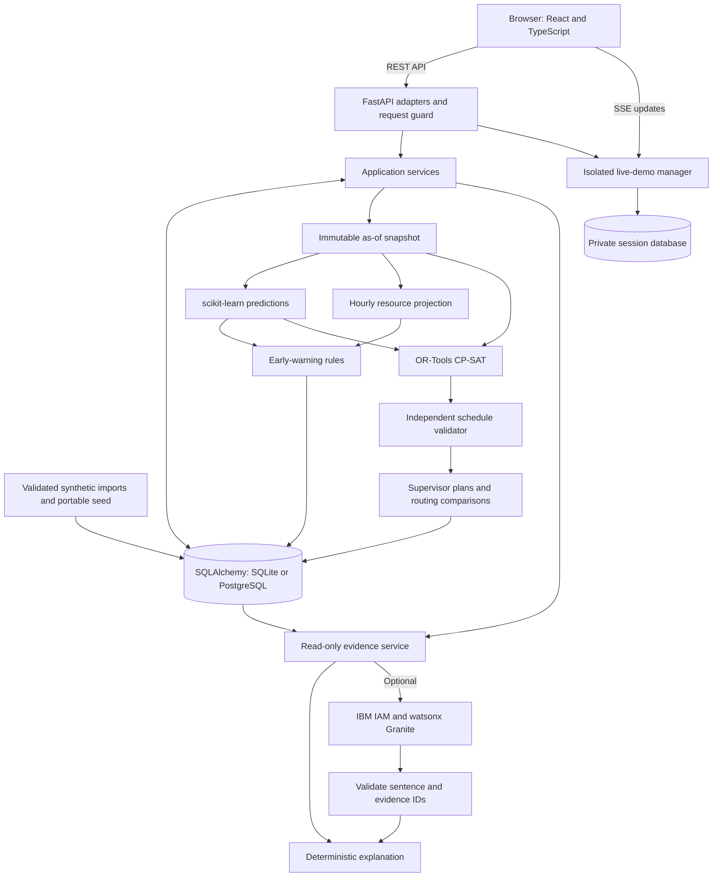

# Architecture

## System Architecture

QUAY uses a React dashboard backed by a layered FastAPI application. HTTP adapters delegate to application services, which construct planning snapshots, run forecasts and schedules, and persist publications through SQLAlchemy repositories. The demo uses SQLite; the database layer also supports PostgreSQL.

## Components

| Component | Technology / location | Responsibility |
|---|---|---|
| Dashboard | React, TypeScript, Vite; `src/frontend/src/` | Display API results, select scope, inspect forecasts, review plans, and export publications. |
| Visualisation | Recharts and Leaflet | Charts, congestion heatmaps, berth timelines, and port network context. |
| HTTP layer | FastAPI; `backend/app/api/` | Validate requests and expose operational, forecast, warning, optimisation, plan, copilot, live, and evaluation routes. |
| Application services | `backend/app/services/` | Orchestrate snapshots, persistence, forecasting, scheduling, approval, and replanning. |
| Persistence | SQLAlchemy, Alembic; `models.py`, `repositories/`, `migrations/` | Store infrastructure, observations, model/run provenance, assignments, alerts, revisions, and audit events. |
| Synthetic simulator | `backend/app/synthetic/` | Generate and validate reproducible fictional datasets and related operational outcomes. |
| Predictive layer | pandas, scikit-learn, joblib; `backend/app/predictive/` | Build point-in-time features, select models chronologically, persist bundles, and perform inference. |
| Scheduling layer | OR-Tools; `backend/app/optimisation/` | Construct candidate assignments, solve shared resource constraints, validate schedules, and report metrics. |
| Supervisor publications | `backend/app/plans/` | Build nine shifts and produce JSON, CSV, and standalone printable HTML. |
| Recommendation and copilot layers | `backend/app/recommendations/`, `backend/app/copilot/` | Compare conditional alternatives and explain trusted records without dispatch authority. |
| Live sessions | `backend/app/live/`, `services/live_demo.py` | Persist simulated events in private branches and stream updates. |

Paths beginning with `backend/` above are relative to `src/`.

## Data Flow

1. **Ingestion and state:** validated data supplies ports, terminals, berths, cranes, vessel calls, resource calendars, weather, tides, yard stock, and observed progress. Snapshot construction includes facts available at the planning origin and explicitly identified scenario assumptions.
2. **Prediction and warnings:** models generate congestion and waiting estimates. Hourly FIFO resource projections supply physical pressure indicators. Alert rules preserve values and thresholds, so operational severity can be explained independently of model probability.
3. **Scheduling and validation:** CP-SAT chooses berth, start time, and compatible crane profiles. Constraints cover shared calendars, vessel compatibility, closures, tide clearance, yard conservation, and protected work. A deterministic feasible baseline supports comparisons; named fallback results are independently checked too.
4. **Publication and approval:** persisted results feed shifts and routing what-ifs. Operational plans move through `DRAFT → REVIEWED → APPROVED`; replacement approvals preserve superseded history. Revision and state checks reject stale approvals. Hypothetical scenarios remain distinct from operational drafts.
5. **Presentation and explanation:** the dashboard reads persisted values. The copilot retrieves backend evidence in a database-enforced read-only transaction. Optional IBM output is accepted only when sentence and evidence IDs match the supplied canonical records.

## Planning and Data Conventions

The published horizon is **72 hours**, represented by hourly forecast buckets and nine eight-hour shifts in UTC. Scheduling uses **15-minute slots** and half-open intervals, allowing adjacent assignments. A **48-hour completion tail** extends computation to 120 hours; an assigned vessel is therefore not necessarily completed within the published 72 hours.

Container moves represent handling work; **TEU** represents inventory and capacity. They are separate fields. Forecast metadata retains dataset hashes, model versions, chronological evaluation, and assumptions. Model candidates include rolling baselines, linear/logistic models, and histogram gradient boosting; selection uses validation data rather than a guaranteed preferred algorithm. Residual-based uncertainty bands do not guarantee coverage at a real port.

## Security Considerations

An environment-backed operator key protects non-public APIs when configured. Access supports `X-Operator-Key` or a signed, time-limited HttpOnly cookie; production cookies use the Secure flag. Exact CORS origins, POST origin checks, body-size limits, login throttling, and expensive-request budgets bound access and work.

Database-backed job leases serialize expensive operational work. Revision checks protect concurrent approvals and replans. Live sessions use private databases and request-scoped dependencies. IBM credentials stay in server-side environment configuration, and provider calls use bounded timeouts, response sizes, and an allowed endpoint list. Explanations cannot mutate plans.

## Scalability Notes

The current design targets a local demonstration with a single API worker. Docker recipes provide a non-root backend container, an Nginx frontend, persistent storage, and an optional PostgreSQL profile. Vite proxies `/api` locally; Nginx proxies API and SSE traffic in containers.

Production configuration requires PostgreSQL and a private operator key, with stricter readiness defaults. Shared deployment still needs enterprise identity and roles, TLS, durable distributed workers, shared rate limits, operational feed reliability, monitoring, and port-specific validation. Existing verification reports do not certify container runtime behaviour or live IBM inference.

## API and Technical References

Canonical endpoints use `/api/v1`; `/docs` and `/openapi.json` expose the running contract. Representative routes include `/dashboard`, `/early-warning/forecasts`, `/optimisation/run`, `/plans/72-hour`, `/plans/{id}/export`, `/recommendations/what-if`, `/copilot/ask`, and `/live-demo/sessions`.

See the [API reference](../src/docs/api-contract.md), [entity design](../src/docs/entities.md), [optimisation reference](../src/docs/optimisation-engine.md), and [rolling-plan lifecycle](../src/docs/rolling-plans.md). Some earlier references contain historical planning notes; current code and running OpenAPI define implemented behaviour.
