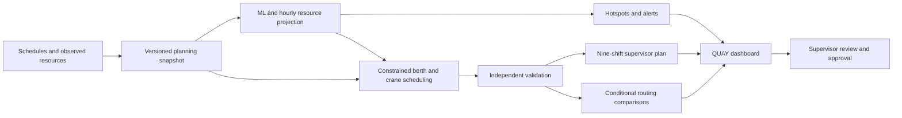

# Solution Overview

## What We Built

**QUAY — Container Congestion Predictor & Port Operations Optimiser** is a browser-based command centre for anticipating port pressure and preparing a rolling 72-hour operations plan. It connects vessel demand with berth, crane, weather, tide, and yard constraints, then presents forecasts and feasible schedule options to supervisors.

The application includes a React dashboard, a FastAPI backend, a synthetic data simulator, versioned scikit-learn models, an OR-Tools scheduling engine, and a BOB Operations Copilot. Core forecasting, optimisation, and explanation workflows run locally without external AI credentials.

## How It Works

1. **Build a planning snapshot.** The backend collects vessel calls, physical resources, known outages, latest observations, and existing commitments at a specified UTC planning origin. The portable demo includes four fictional ports, 60 historical days, and a seven-day published vessel schedule.
2. **Predict future pressure.** Versioned models estimate congestion and vessel waiting. A separate resource projection estimates hourly berth, crane, and yard pressure. The dashboard distinguishes model probability, projected outcomes, operational severity, and confidence.
3. **Identify hotspots.** Configurable rules produce alerts for resource pressure, waiting, and arrival surges. Alerts retain threshold evidence, source runs, confidence limitations, and acknowledgement history.
4. **Generate resource assignments.** CP-SAT selects feasible berth windows and crane profiles on a 15-minute grid. An independent validator checks the result. Deferred vessels, conflicts, and fallback schedules remain visible.
5. **Compare alternatives.** The recommendation engine evaluates keeping the current plan, arrival adjustments, alternate terminals, and eligible alternate ports. Comparisons include delivery timing, travel and handling costs, receiving resources, uncertainty, and rejection reasons.
6. **Publish and review.** The schedule becomes nine consecutive eight-hour shifts. Supervisors review a draft, approve eligible operational changes, and export JSON, CSV, or printable HTML. Changed observations trigger a new draft while preserving started work and protected near-term reservations.

## Architecture Diagram

See [architecture.md](architecture.md) for persistence, API boundaries, live sessions, and the optional IBM explanation flow.

## User Experience

The **Executive overview** summarises the selected persisted plan and port scope. The **Congestion heatmap** shows hourly pressure and lets users inspect recorded causes, thresholds, inputs, and assumptions. **Berth planning** displays vessel assignments and crane work; the **Port network map** provides network context and conditional alternatives.

The **Supervisor shift plan** contains assignments, alerts, actions, contingencies, and handover notes. **Live operations** injects events into an isolated demo session and displays changed risks and rolling drafts. The development interface also includes a **Scenario lab** for hypothetical changes. **Strategy evaluation** compares scheduling approaches, while **BOB Operations Copilot** answers questions about selected records.

## Key Design Decisions

| Decision | Rationale |
|---|---|
| Separate prediction, scheduling, and explanation | Each has a clear responsibility; operational figures come from recorded data and computation. |
| Use immutable snapshots and versioned runs | Forecasts, schedules, and explanations can be traced to their inputs and model version. |
| Validate schedules independently | A solver result must pass resource and safety checks before operational approval. |
| Keep routing conditional | An attractive comparison does not establish customer permission or a receiving-port reservation. |
| Protect started and near-term work | Rolling replanning must remain consistent with physical operations and accepted commitments. |
| Ship a portable synthetic seed | Reviewers can reproduce the demo without private data or existing generated artifacts. |

## IBM Technologies Used

The BOB Operations Copilot has an optional **IBM watsonx.ai / Granite** adapter. It authenticates through IBM IAM and calls the watsonx chat endpoint. The server supplies canonical explanation sentences and evidence identifiers; Granite returns their ordering, which the server validates before assembling the answer. Unsupported output or provider failures return a clearly labelled local fallback.

The forecasting and scheduling engines compute operational results, while supervisors approve plans. The runtime IBM integration documented here is the watsonx.ai / Granite adapter; any development use of IBM Bob should be supported by separate team evidence. The existing [IBM verification report](../src/docs/watsonx-verification.md) records local and mocked checks, with live authenticated inference still uncertified.

## Impact and Current Scope

The frozen [bundled evaluation](../src/demo/recorded/hackathon-evaluation.md) shows improved served-vessel average waiting with joint scheduling across normal, surge, and storm scenarios. It also reports deferrals, worse maximum waits, and significant surge forecast errors. That evaluation demonstrates no incremental primary scheduling benefit from predictive weighting or routing advice.

QUAY demonstrates an auditable planning workflow with human approval. Its current evidence comes from fictional ports and synthetic-trained models; cost and emissions figures remain simulation proxies. Real feeds, terminal integration, port-specific policy validation, and production identity services are future work.
