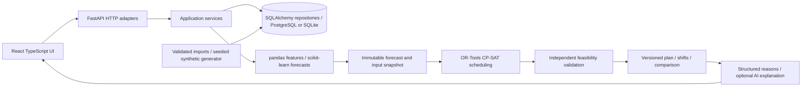

# Phase 1 architecture and repository assessment

## Existing repository

Inspected on 2026-09-13. Git root is the parent `IBM-BOBATHON` directory;
the application workspace is `src`. It contained only a generic `README.md`
and ignored-but-present `.env.example`. Git status was clean. No existing API,
frontend, database, dataset, model, tests, deployment configuration or applicable
AGENTS.md was found. Parent submission files and ignore rules were preserved.
The starter README and environment template were replaced with project-specific
instructions; optional watsonx settings remain available without credentials.

Local environment: Windows PowerShell, Node 22.13.0, npm 10.8.2, Python 3.12.3.
FastAPI and Uvicorn existed globally; pytest did not. Backend dependencies are
installed in an isolated workspace virtual environment. Docker CLI is absent.

## Component architecture

React + Vite avoids an unnecessary server-rendering layer for this dashboard.
Later add Recharts for time series, comparisons and resource utilisation;
Leaflet/OpenStreetMap for port locations and candidate alternatives. Backend
OpenAPI is the authority for generated TypeScript DTOs. Charts consume API
numbers; frontend never recomputes schedules or invents forecasts.

Planned backend packages: `domain` (rules and units), `schemas` (Pydantic DTOs),
`repositories` (SQLAlchemy persistence), `services` (use cases), `forecasting`
(features, training, inference), `optimisation` (model, solver, validator),
`simulation` (event-based evaluation), `explanations` (reason templates and
optional watsonx adapter), `api` (thin HTTP adapters). Create packages as their
implementations arrive rather than adding empty functions now.

Use a single API process and one bounded background job executor for the demo;
persist job status and mark interrupted jobs failed on restart. Never run a
solver on the event loop. Add a durable worker queue before multiple API workers
or production deployment. Cache by input snapshot, model version and parameters.
No live terminal-system writes or autonomous operational execution are planned.

## Hackathon defaults and definitions

- Current synthetic phase: four fictional ports, each with 3-6 terminals,
  2-3 berths per terminal, named cranes and one aggregate yard per terminal.
  Six calls per port/day before scenario surges. Never label synthetic metrics as
  measured port performance. Seed 42 and a fixed epoch, not wall-clock time,
  determine data. This phase generates 60 historical days and a separate seven-day
  schedule. Expand history for chronological training/holdout in the ML phase.
- Store instants as UTC, serialize RFC 3339 with `Z`; require timezone-aware input
  and normalize offsets. PostgreSQL uses timestamptz; SQLite uses an explicit
  UTC serialization type. Display local time only with a visible timezone label.
- Exactly 72 hours from `as_of`, with hourly forecasts and 15-minute scheduling
  slots. A plan contains nine contiguous 8-hour operational shifts. Default
  `as_of` is midnight UTC for three calendar days; arbitrary starts produce nine
  rolling shifts and are not claimed to match local labour shifts.
- Half-open intervals `[start, end)` allow adjacent assignments. Conservatively
  round arrivals up and service durations up to slots; round downtime outward.
  Retain source precision. Include carry-in vessels and yard inventory; account
  for jobs extending beyond 72 hours using a bounded completion tail.
- Throughput is container moves/hour; inventory is TEU. Each call explicitly
  supplies both move count and TEU, avoiding a false one-to-one conversion.
- Weather has a forecast issuance time and validity interval. Configured wind,
  visibility and tide safety limits impose closures; milder conditions lower
  productivity. Thresholds are demo assumptions requiring port validation.
- Congestion event: queue >= 2 vessels OR berth occupancy >= 85% for two
  consecutive hourly buckets. Report event probability plus queue, berth, crane
  and yard utilisation separately. Alert defaults: probability >= 0.7, yard
  >= 85%, or waiting-time median >= 4 hours; all are configurable demo policy.
- Baseline is imported current assignments when present, otherwise a deterministic
  earliest-arrival feasible first-come-first-served plan. Invalid imports report
  violations; a repaired feasible baseline is explicitly labelled. Both plans
  use the same snapshot, time horizon and simulation assumptions.
- Delayed arrivals are bounded to 12 hours and compared on total ETA-to-completion
  time and costs, not just apparent anchorage waiting. Diversion candidates need
  compatibility, transit time, receiving capacity and vessel permission; unknown
  capacity excludes a candidate. Alternatives are advisory and require supervisor
  acceptance. Start with a small allowlisted network rather than maritime routing.
- Replanning defaults hourly and on scenario events; preserve completed/in-progress
  work and freeze the next two hours of accepted assignments. Relaxing frozen work
  is a separately requested scenario, never an implicit response to infeasibility.

## ML, optimisation and explanation boundaries

ML uses information available at `as_of`: arrival bunching, requested moves,
compatible berth count, crane availability/productivity, yard occupancy/outflow,
issued weather forecast, and historical performance lags. Train separate
hour-ahead congestion classifiers and waiting/service-time regressors initially;
port/berth level results include sparse-data quality flags. Compare to persistence,
rolling historical medians and demand/capacity heuristics. Split chronologically
with a 72-hour purge; group calls and fit preprocessing only on training data.
Do not use actual future service outcomes, realised weather or future queue as
features. Synthetic service distributions are assumptions, not observed labels.

Return nonnegative waiting-time median with an 80% prediction interval (p10/p90),
using quantile regressors and held-out calibration. This is an outcome prediction
range, not a confidence interval for a model parameter. Track waiting MAE,
interval coverage/width, congestion PR-AUC and Brier score by horizon/port.
Persist seed, dataset hash, feature schema, train cutoff, model version and metrics.
Uncalibrated synthetic ranges carry an explicit quality label. Inference falls
back to documented deterministic heuristics if data/models are insufficient.

CP-SAT receives validated immutable calls, resources, availability calendars,
yard balances, forecast productivity and scenario constraints. Decisions include
port/berth choice, arrival adjustment, start/end slots and crane bundles. Initially
enumerate compatible crane bundles with fixed forecast-based service durations;
optional intervals select exactly one bundle/berth for each scheduled vessel.
Crane intervals cannot overlap or ignore transfer downtime; bundle cranes must
be compatible with the berth. No-overlap enforces berth exclusivity. Cumulative
constraints enforce resource capacities. Yard TEU recurrence accounts for initial
inventory, phased unloads, export removals and explicit gate outflows; no unexplained
inventory disappearance. Draught/length, weather closures and work already started
are hard constraints. Any unscheduled call must be explicit with a reason.

Use integer slots and scaled integer cost units: CP-SAT requires integer
constraints ([official solver documentation](https://developers.google.com/optimization/cp/cp_solver)).
Optimise lexicographically: minimise unserved required calls, then ETA-to-completion
and lateness costs, diversion/arrival-adjustment costs, then schedule changes and
unused resources. Publish units and configurable weights. Waiting forecast is
baseline evidence; optimised waiting derives from the schedule and simulation,
never from subtracting an arbitrary improvement percentage from ML predictions.

Demo solver timeout 10 seconds, seed 42, one worker for repeatability. Return
OPTIMAL, FEASIBLE, INFEASIBLE or UNKNOWN, objective/bound/gap where defined, runtime
and unscheduled demand. FEASIBLE does not mean proven optimal; UNKNOWN cannot be
presented as infeasible. Independently validate every returned plan. On failure,
keep the last valid accepted plan, mark it stale and show violated constraints;
never silently relax safety constraints. Simulate weather/service uncertainty
using identical seeded samples for baseline and optimised comparisons.

Every alert/recommendation has a structured reason code, source entity/metric,
actual value, threshold, forecast/plan references and counterfactual delta. Those
records drive deterministic explanation templates. Optional generative AI sees
only this evidence and returns a summary plus evidence IDs; reject unknown IDs
and unsupported numerical claims and fall back to templates. AI never trains
labels, calculates KPIs, changes constraints or creates assignments. Core demo
works without an API key. All operational recommendations remain decision support.

## Main risks

| Risk | Mitigation / remaining limit |
| --- | --- |
| No real operational history | Seeded data and transparent assumptions; synthetic accuracy proves plumbing, not field validity. |
| Incomplete yard, tide or crane constraints | Independent validator and explicit compatibility; aggregate yard excludes block/stack and reefer detail. |
| Solver explosion or infeasibility | Bound candidate bundles/ports, slot grid and timeout; expose status, carry-in, tail and unscheduled calls. |
| Forecast leakage or false certainty | As-of joins, time split/purge, baselines, held-out coverage and quality labels. |
| Schedule churn | Freeze window, immutable revisions, optimistic locking and acceptance audit. |
| Diversion shifts congestion elsewhere | Evaluate all candidate-port capacity and transit/cost on one snapshot; no unsupported receiving-port assumptions. |
| Baseline KPI gaming | Same cohort, accounting origin, simulator and seed; include delay/diversion and unserved vessels. |
| Missing/stale weather or port observations | Provenance/freshness checks; flag degraded forecasts and block actions needing unknown safety information. |
| SQLite/PostgreSQL differences | UTC adapter, migrations, FK enforcement and both-database tests in persistence phase. |
| External maps/network and credentials | Text/table fallback, attribution, no map dependence in planning; explanations work offline. |
| Demo job executor loses work | Persist state and mark interrupted jobs; durable worker is a later production requirement. |
| No production authentication | Local demo only; role-based access and deployment hardening before shared use. |

Vite runtime requirements were checked against the
[official guide](https://vite.dev/guide/). Dependencies are locked after install.
Containers follow [FastAPI's own-image guidance](https://fastapi.tiangolo.com/deployment/docker/).
Container builds remain unverified until Docker is available.
