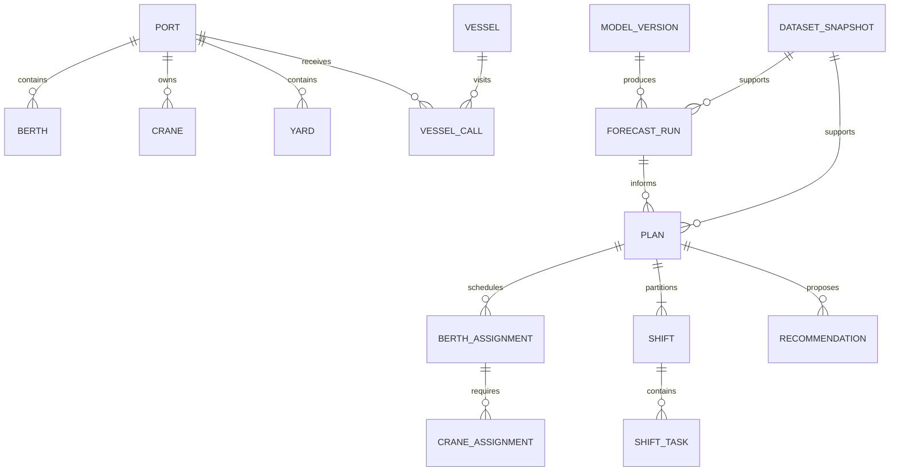

# Persistence design and implemented extensions

The original proposed design below is retained for context. Implemented migrations
and their operational additions are documented here and in the linked guides.

Responsible recommendation migration **0009** adds `RecommendationRun` with an
FK to `OptimisationRun`, and `RecommendationDecision` with FKs to that run,
`VesselCall` and `Port`. One decision per call/run stores the full immutable
five-action comparison, execution witnesses, commercial assumptions and rejection
evidence. Runs store exact inputs, effective policy, engine/model versions, source
state revision and input hash; decisions store UTC expiry. These audit tables
provide independent what-ifs and do not change approvals or resource reservations.
See [the implemented contract and field dictionary](responsible-recommendations.md).

The synthetic-data phase implements a dedicated normalized demo seed schema
in `backend/app/synthetic/storage.py`, with four ports, terminals and one yard per
terminal. See [the actual simulator dictionary](data-dictionary.md) and
[seed guide](synthetic-data.md). The entities below remain the broader proposed
application design. The operational backend now maps the resource/observation
schema to named SQLAlchemy ORM entities and adds forecast runs/buckets, scenarios,
optimisation runs, berth and planned crane assignments, recommendations, supervisor
plans/shifts, approval audit, planning-state revision and seed provenance. Predictive
intelligence adds related port/terminal probabilities and vessel waiting predictions,
each with immutable model version, uncertainty and factors. Observation events
retain known arrivals/entries for queued or in-progress calls. Early warning adds
hourly operational forecasts at all three scopes, frozen rules/hotspot summaries,
lifecycle alerts, evidence events and scoped watermarks. Executable assignments
add separate processing completion, a versioned JSON crane/shift profile and
individual supersession timestamps. CraneAssignment rows reference one physical
crane and one berth assignment, with unique (assignment_id, crane_id, start),
allowing multiple discontinuous productive segments. Eight
Alembic revisions own the application schema. See [the backend guide](operational-backend.md)
for current relationships; broader ML/calibration/replanning entities remain proposed.

SQLAlchemy 2 + Alembic; PostgreSQL primary, SQLite local fallback. Use portable UUID
strings, explicit enum checks and JSON for immutable evidence/snapshots, not core
resource relations. Enable SQLite foreign keys on every connection. All instants
are UTC and intervals half-open. Migration scripts own schema creation.

| Entity | Key fields and relationships |
| --- | --- |
| Port | id, unique code, name, latitude/longitude, IANA display timezone, active |
| Berth | id, port_id FK, unique port/name, max_length_m, max_draught_m, availability |
| Crane | id, port_id FK, moves_per_hour, active, transfer_minutes |
| BerthCraneCompatibility | berth_id + crane_id composite PK; compatible cranes explicitly listed |
| Yard | id, port_id FK, capacity_teu; demo one yard per port |
| ResourceAvailability | id, resource kind/id via explicit berth/crane/yard nullable FKs with exactly-one check, start/end, capacity, reason |
| Vessel | id, unique vessel code (IMO optional), name, length_m, draught_m, max_cranes |
| VesselCall | id, vessel_id, port_id, eta, requested_departure, unload/load_moves, unload/load_teu, priority, allowed_delay_minutes, diversion_allowed, status, revision |
| CallCandidatePort | call_id + port_id PK, transit_minutes, additional_cost_minor, compatibility status, observed_at |
| YardObservation | id, yard_id, observed_at, inventory_teu, gate_outflow_teu_per_hour, source |
| WeatherForecast | id, port_id, issued_at, valid_from/to, wind_mps, visibility_m, tide_m, source |
| HistoricalCallPerformance | call_id FK, actual_arrival/start/end, crane_hours, moves, known_at; training labels only |
| DatasetSnapshot | id, as_of, source_revision/hash, seed, generator_version, immutable validated inputs JSON |
| ModelVersion | id, dataset_hash, artifact_path/hash, feature_schema, trained_until, seed, metrics JSON, quality |
| ForecastRun | id, snapshot_id, model_version_id, as_of, horizon_hours=72, status, quality, created_at |
| ForecastBucket | id, run_id, port_id, optional berth_id, bucket_start, probability, queue_estimate, berth/crane/yard utilisation; unique run/resource/hour |
| WaitingPrediction | id, run_id, call_id, median_minutes, p10_minutes, p90_minutes, quality; unique run/call |
| Scenario | id, base_snapshot_id, name, validated overrides JSON, parent_plan_id, created_at |
| Job | id, kind, status, input snapshot/scenario, created/start/end, result_id, safe error, progress |
| Plan | id, snapshot_id, forecast_run_id, scenario_id, parent_plan_id, kind baseline/optimised, revision, status draft/accepted/superseded, as_of/end, solver_status, objective/bound, policy JSON |
| BerthAssignment | id, plan_id, call_id, berth_id, adjusted_eta, start/end, moves/teu, duration basis; unique plan/call |
| CraneAssignment | id, berth_assignment_id, crane_id, start/end; exact crane bundle persisted |
| YardAllocation | id, plan_id, yard_id, call_id, bucket_start, inbound/outbound_teu, inventory_after_teu |
| Shift | id, plan_id, index 0..8, start/end; unique plan/index |
| ShiftTask | id, shift_id, assignment_id, task_type, owner_role, start/end, resource references, handover JSON |
| Recommendation | id, plan_id, call_id optional, kind alternate_port/delayed_arrival/resource_change, proposed values JSON, predicted impact JSON, status proposed/accepted/rejected |
| EvidenceReason | id, forecast/plan/recommendation references, code, entity references, metric, value/unit, threshold, delta, provenance JSON |
| PlanComparison | id, baseline_plan_id, optimised_plan_id, evaluation_version/seed, metrics JSON, uncertainty JSON |
| AuditEvent | id, actor, action, entity_type/id, previous/new revision, occurred_at, metadata JSON |

FKs restrict deletion of inputs used by plans. Archive records instead of deleting
history. Snapshot and plan outputs are immutable; acceptance and supersession use
transactions and revision checks. Index port/eta, resource/start/end, weather
port/issued_at/valid_from, plan/status/as_of and job/status. Reject duplicate import
keys transactionally. No database is created by the Phase 1 liveness endpoint.

Validation: positive dimensions and capacity, nonnegative demand/inventory/costs,
lat/lon bounds, valid IANA timezone, end > start, p10 <= median <= p90, probability
and utilisation within [0,1] (overflow is a separately reported ratio), reference
integrity and compatible resource membership. Resource overlap and yard balance
are cross-record service rules verified before plan acceptance, not just DTO checks.

Migration 0010 adds `plan_publications` (one per supervisor plan, optional prior
approved-plan foreign key, versioned document and review actor/time),
`plan_state_events` (plan/state/revision/actor/time/reason),
`operational_update_events` (base plan, operational revision, actor/time and exact
typed observations) and `crane_restoration_observations` (crane, observed time and
actor). Shift records gain full publication `details` JSON. Carry-in records gain
nullable measured remaining unload/load moves; legacy imports retain conservative
scalar remaining moves until measured progress is provided. Plan state is exposed
as uppercase DRAFT/REVIEWED/APPROVED/SUPERSEDED; active retained assignment
reservations survive supersession. Existing approvals and source snapshots remain.

## Live operations persistence (migration 0011)

All dates below are UTC instants. Identifiers are opaque strings; quantities use
TEU, hours, USD or tonnes CO2 as explicitly named in result payloads.

| Table | Fields and relationships |
| --- | --- |
| `live_demo_sessions` | `id` primary key; `port_id` FK to ports; `created_at` wall time; `clock` simulated operational time; `revision` positive concurrency counter; `status` READY/PROCESSING; `initial_run_id` and `latest_run_id` optimisation IDs in the private snapshot; `active_event_id` control-log event ID; `settings` JSON containing seed, source run, solver limit and simulation assumptions |
| `live_demo_events` | `id` primary key; `session_id` FK; `sequence` positive, unique within session; `kind` validated event type; `status` processing stage or SUCCEEDED/FAILED; `stage_revision` positive SSE cursor counter; `created_at`/`updated_at` wall times; `operational_time` target clock; `payload` validated request JSON; nullable `result` measured result/run/plan/change JSON; nullable `error` failure code, message and committed-effect flag |
| `live_demo_receipts` | Private snapshot only: `event_id` primary key referencing the control-log event; `run_id` local optimisation FK; `clock` committed operational time; `result` immutable result JSON. Committed in the same transaction as effects and the draft, preventing retry duplication |
| `berth_closure_windows` | `id` primary key; `berth_id` FK; `start` inclusive and `end` exclusive closure instants, end > start. Closure pauses handling and prevents new entry/departure while preserving existing berth ownership |
| `yard_capacity_observations` | `id` primary key; `terminal_id` FK; `timestamp` effective observed instant, unique per terminal; `capacity_teu` positive usable capacity, bounded by nominal capacity and current stock in the service layer |
| `known_storm_advisories` | `id` primary key; `port_id` FK; `known_at` publication instant; future `start`/`end` severe-weather window, end > start >= known_at; nullable `cancelled_at` actual simulated cancellation. Only advisories known and uncancelled at origin enter forecasts |
| `yard_reconciliations` | `snapshot_id` primary key/FK to an existing yard snapshot; `known_at` instant the current reconciliation is available. Unmarked legacy rows remain completed-hour observations; raw observation timestamps are preserved |

Run/event references spanning the control DB and private snapshot intentionally
have no cross-database SQL FK. All operational resource relationships remain local
FKs and are checked when copying a PostgreSQL source into SQLite. See
[live-demo contracts, event semantics and measurements](live-operations-demo.md).
