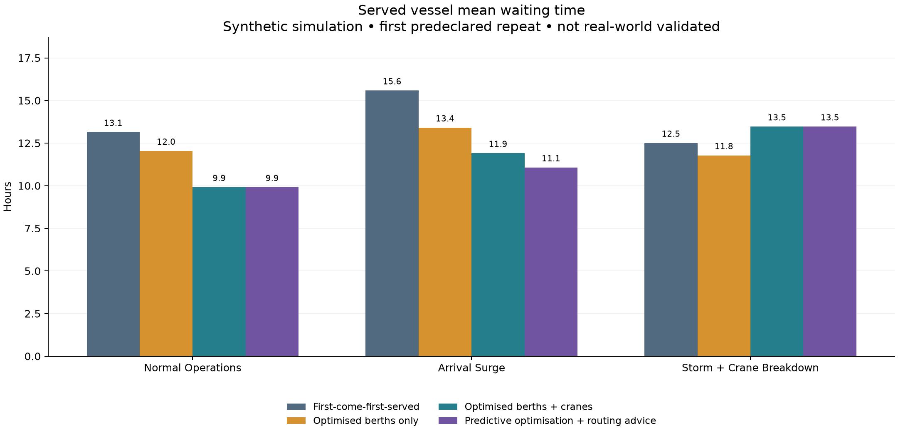
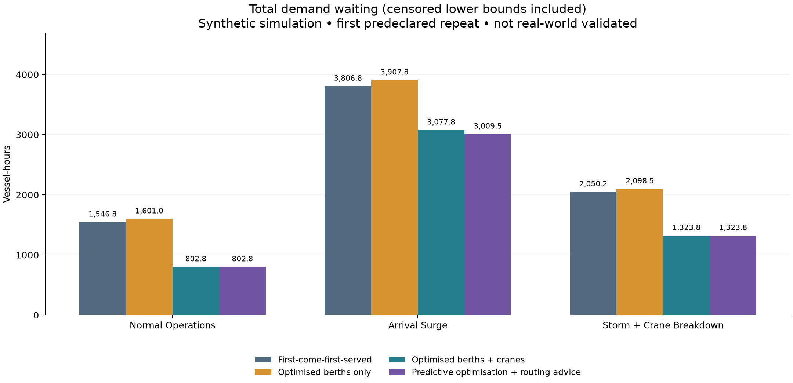
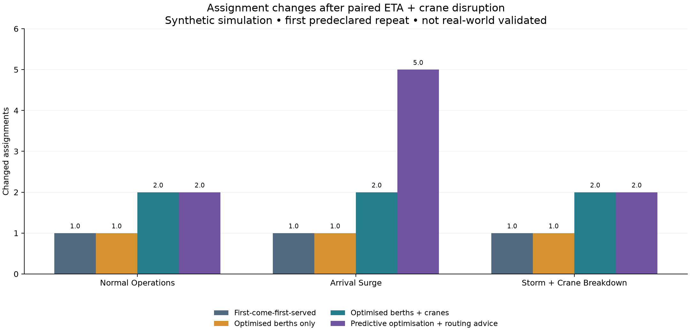
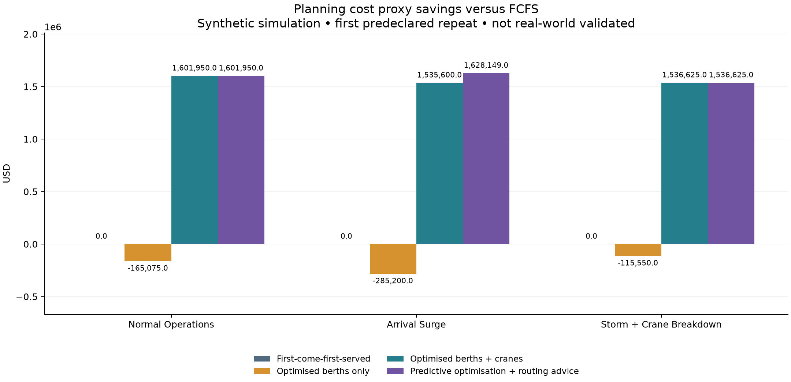
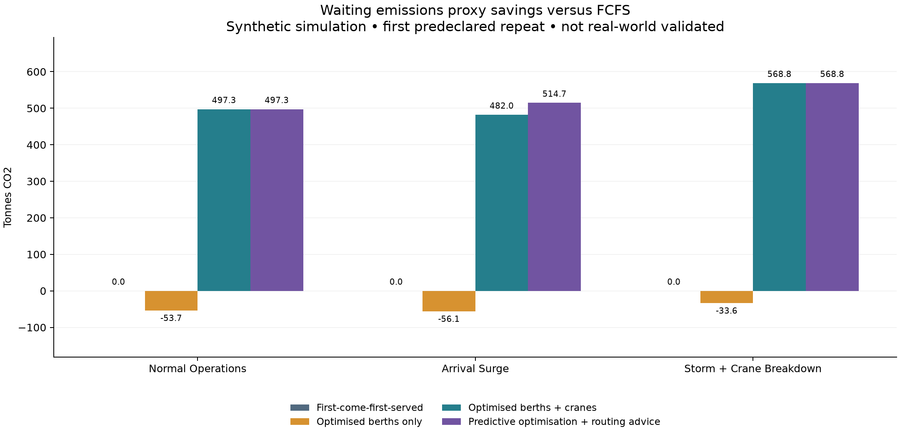
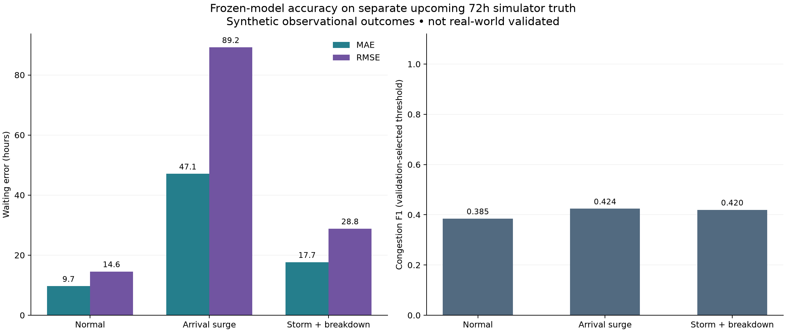

# Hackathon strategy evaluation

Generated 2026-09-14T11:33:43.166625+00:00. **All figures are synthetic planning simulations,
not real-world validated savings.** Model: `ml-v1-f68bbf268d35a8c2`.

## Observed findings

- Normal Operations: FCFS serves 72/81 with 13.15h served mean wait; joint scheduling serves 81/81 with 9.91h. Accounting difference: $1,601,950 and 497.32t CO2 simulated proxy savings.
- Arrival Surge: FCFS serves 73/105 with 15.59h served mean wait; joint scheduling serves 81/105 with 11.91h. Accounting difference: $1,535,600 and 482.02t CO2 simulated proxy savings.
- Storm + Crane Breakdown: FCFS serves 67/81 with 12.51h served mean wait; joint scheduling serves 76/81 with 13.47h. Accounting difference: $1,536,625 and 568.82t CO2 simulated proxy savings.

Forecast-aware planning changes 1 vessel decisions relative to joint berth/crane scheduling. The high-risk and forecast-weighted waiting columns below isolate whether those proactive changes help the vessels the model flagged.

**Forecast validation requirement:** Arrival Surge waiting MAE is 47.09h and RMSE 89.21h. Congestion F1 ranges from 0.385 to 0.424. These synthetic scores do not establish operational reliability; independent validation is required before operational use.

The severe-surge forecast error and congestion classification performance are material weaknesses of the current model.

Joint served maximum wait exceeds FCFS in 3 of 3 scenarios. The objective therefore penalises squared waiting above 24.0h and reports fairness breaches/excess hours explicitly; this makes the throughput-versus-tail trade-off auditable. Acceptance sets can still differ, so a global improvement for every vessel is not assumed. Solver status counts: `{"NOT_APPLICABLE": 3, "FEASIBLE": 9}`.

Catalogue-relative incumbent gaps range from 0.268 to 1.000; no near-optimality or global optimum is established by weak bounds under this time budget.


Read served means with deferrals and total demand delay: a lower served average
can coexist with worse total delay/cost. Deferral penalties and censored waiting
allowances contribute materially to the simulated economic differences. Frozen
stability and zero-overflow constraints show safety behaviour in this model,
not certified safety or realised congestion relief at a port.

Accepted difficult vessels are excluded from another strategy's served-only
statistics when deferred. Compare acceptance, tails and priority violations
together before claiming a better operational outcome.

## Protocol and comparison boundaries

Four strategies use the same per-scenario as-of snapshot, the same synthetic
regional port network, 72-hour arrival cohort and imported ongoing work. Scheduling
uses a 15-minute grid and a 48-hour completion tail (120 hours in total). Sources
are the existing audited demo run snapshots, opened read-only. Manifest/snapshot
hashes, run IDs and announced hazards are in `artifacts/evaluation/summary.json`.
Storm calendar windows are explicitly hypothetical known advisories, supplied
equally to every strategy, rather than retrospectively discovered predictions.

1. FCFS sorts by ETA/release and call ID; <=2 compatible live home cranes.
2. Berth-only CP-SAT optimises berth and start selection using the same <=2-crane
   execution rule. Crane-count optimisation is disabled.
3. Joint CP-SAT additionally chooses maximum/economical/shift-balanced crane
   profiles. Prediction-risk weight is zero.
4. Predictive CP-SAT uses the persisted model's severity-and-confidence risk penalty
   and runs responsible routing/arrival comparisons on severe-delay vessels. At most
   one eligible recommendation per scenario is treated as a **simulated human
   approval**, then jointly reoptimised against receiving berth/crane/yard capacity.
   Rejections and every applied assignment remain visible in the routing audit.

All strategies enforce the production compatibility, tide, crane calendars,
conserved safe yard staging, safety buffers and frozen-work validator. Deferral
is permitted and shown explicitly. The bounded CP-SAT candidate catalogue is
not an exhaustive continuous-time optimum; OPTIMAL is relative to that catalogue.
Greedy fallback is named when solver time expires without an incumbent.

Each strategy runs {evaluation['repeats']} times at {evaluation['solver_seconds']}s
maximum solver time, random seed 42, one solver worker. **Repeat 1 is predeclared
as the primary result**, with every repeat and min/max ranges retained. Repeats
measure time-budget repeatability, not independent operational replications;
they do not justify statistical confidence intervals or significance claims.
Hardware load can change incumbents. Engine runtime includes preparation,
catalogue generation and validation; solver runtime is reported separately.

## Metric definitions

The 72h window defines the arrival cohort and resource-utilisation denominator.
The production engine permits berth starts as well as completions in its 120h
computation window. Served therefore means assigned within 120h, not necessarily
berthed or departed within the rolling 72h publication.

Mean/P90/max waits describe served nonfixed vessels, measured from observed arrival
when known, otherwise scheduled ETA. P90 uses NumPy's linear interpolated quantile.
Unserved counts accompany these statistics: acceptance differences can make served
averages misleading. Total delay is **sum of vessel waiting**, including each
unserved call's lower bound at the 120-hour computation cutoff. Departure-delay
hours are separate and measured against requested departure or ETA +
{policy['target_turnaround_hours']}h. Censored quantities are not completed outcomes.

Berth utilisation includes carry-in/frozen occupancy divided by installed
berth-hours over 72h. Crane utilisation is assigned crane-hours divided by
maintenance-, closure- and weather-adjusted available crane-hours over 72h.
Yard overflow is summed terminal-hours above physical capacity; network-hours
count the union of overflow timestamps. Safe-capacity exceedance is also recorded.
Zero overflow is enforced by deferral/conservative staging; it is not evidence
that operational yard congestion was eliminated. Priority SLA is wait strictly
above {evaluation['priority_wait_sla_hours']}h for priority ranks 1 through
{evaluation['priority_rank_cutoff']}; this is a fictional evaluation SLA.

## Waiting and demand

| Scenario | Strategy | Demand | Served | Deferred | Mean h | P90 h | Max h | Wait > fairness target | Excess h | High-risk mean h | Forecast-weighted h | Total waiting h* | Departure delay h* |
| --- | --- | --- | --- | --- | --- | --- | --- | --- | --- | --- | --- | --- | --- |
| Normal Operations | First-come-first-served | 81 | 72 | 9 | 13.15 | 39.52 | 147.00 | 13 | 302.75 | 22.09 | 24.03 | 1,546.75 | 1,966.25 |
| Normal Operations | Optimised berths only | 81 | 70 | 11 | 12.04 | 35.73 | 174.50 | 11 | 291.25 | 20.58 | 22.53 | 1,601.00 | 2,002.50 |
| Normal Operations | Optimised berths + cranes | 81 | 81 | 0 | 9.91 | 26.50 | 163.75 | 12 | 280.50 | 9.49 | 9.81 | 802.75 | 891.75 |
| Normal Operations | Predictive optimisation + routing advice | 81 | 81 | 0 | 9.91 | 26.50 | 163.75 | 12 | 280.50 | 9.49 | 9.81 | 802.75 | 891.75 |
| Arrival Surge | First-come-first-served | 105 | 73 | 32 | 15.59 | 43.50 | 147.00 | 16 | 460.25 | 51.11 | 74.25 | 3,806.75 | 3,642.50 |
| Arrival Surge | Optimised berths only | 105 | 70 | 35 | 13.41 | 40.35 | 174.50 | 13 | 368.75 | 50.80 | 75.70 | 3,907.75 | 3,734.00 |
| Arrival Surge | Optimised berths + cranes | 105 | 81 | 24 | 11.91 | 35.50 | 163.75 | 14 | 398.50 | 42.88 | 64.95 | 3,077.75 | 2,579.75 |
| Arrival Surge | Predictive optimisation + routing advice | 105 | 81 | 24 | 11.07 | 33.00 | 163.75 | 13 | 353.50 | 41.68 | 61.20 | 3,009.50 | 2,514.75 |
| Storm + Crane Breakdown | First-come-first-served | 81 | 67 | 14 | 12.51 | 42.50 | 66.50 | 15 | 271.00 | 28.08 | 31.43 | 2,050.25 | 2,357.00 |
| Storm + Crane Breakdown | Optimised berths only | 81 | 66 | 15 | 11.78 | 42.00 | 57.50 | 14 | 237.00 | 26.40 | 29.80 | 2,098.50 | 2,405.25 |
| Storm + Crane Breakdown | Optimised berths + cranes | 81 | 76 | 5 | 13.47 | 40.75 | 164.00 | 17 | 435.25 | 16.14 | 17.14 | 1,323.75 | 1,414.25 |
| Storm + Crane Breakdown | Predictive optimisation + routing advice | 81 | 76 | 5 | 13.47 | 40.75 | 164.00 | 17 | 435.25 | 16.14 | 17.14 | 1,323.75 | 1,414.25 |

*Includes censored lower bounds when deferred > 0. Read with served/deferred counts.





## Resources, priority and routing

| Scenario | Strategy | Berth % | Crane % | Yard overflow terminal-h | Priority SLA violations | Applied port reroutes |
| --- | --- | --- | --- | --- | --- | --- |
| Normal Operations | First-come-first-served | 54.66 | 26.33 | 0 | 22 | 0 |
| Normal Operations | Optimised berths only | 53.92 | 25.97 | 0 | 21 | 0 |
| Normal Operations | Optimised berths + cranes | 45.75 | 40.25 | 0 | 14 | 0 |
| Normal Operations | Predictive optimisation + routing advice | 45.75 | 40.25 | 0 | 14 | 0 |
| Arrival Surge | First-come-first-served | 54.66 | 26.33 | 0 | 34 | 0 |
| Arrival Surge | Optimised berths only | 54.11 | 26.07 | 0 | 33 | 0 |
| Arrival Surge | Optimised berths + cranes | 45.86 | 40.24 | 0 | 26 | 0 |
| Arrival Surge | Predictive optimisation + routing advice | 46.43 | 40.77 | 0 | 26 | 1 |
| Storm + Crane Breakdown | First-come-first-served | 53.08 | 24.95 | 0 | 22 | 0 |
| Storm + Crane Breakdown | Optimised berths only | 52.77 | 24.78 | 0 | 22 | 0 |
| Storm + Crane Breakdown | Optimised berths + cranes | 45.68 | 37.22 | 0 | 18 | 0 |
| Storm + Crane Breakdown | Predictive optimisation + routing advice | 45.68 | 37.22 | 0 | 18 | 0 |

## Plan stability and solver performance

| Scenario | Strategy | Changed assignments | Eligible unchanged fraction | Frozen changed | Solver status | Source | Solver ms | Engine ms | Catalogue gap |
| --- | --- | --- | --- | --- | --- | --- | --- | --- | --- |
| Normal Operations | First-come-first-served | 1 | 0.99 | 0 | NOT_APPLICABLE | fcfs | 0 | 765 | N/A |
| Normal Operations | Optimised berths only | 1 | 0.99 | 0 | FEASIBLE | cp_sat | 3024 | 7244 | 0.45 |
| Normal Operations | Optimised berths + cranes | 2 | 0.97 | 0 | FEASIBLE | cp_sat | 3036 | 7431 | 0.36 |
| Normal Operations | Predictive optimisation + routing advice | 2 | 0.97 | 0 | FEASIBLE | cp_sat | 3034 | 7434 | 0.36 |
| Arrival Surge | First-come-first-served | 1 | 0.99 | 0 | NOT_APPLICABLE | fcfs | 0 | 1880 | N/A |
| Arrival Surge | Optimised berths only | 1 | 0.99 | 0 | FEASIBLE | cp_sat | 3025 | 11010 | 0.27 |
| Arrival Surge | Optimised berths + cranes | 2 | 0.97 | 0 | FEASIBLE | cp_sat | 3373 | 52896 | 1.00 |
| Arrival Surge | Predictive optimisation + routing advice | 5 | 0.96 | 0 | FEASIBLE | cp_sat | 3402 | 46063 | 1.00 |
| Storm + Crane Breakdown | First-come-first-served | 1 | 0.98 | 0 | NOT_APPLICABLE | fcfs | 0 | 4157 | N/A |
| Storm + Crane Breakdown | Optimised berths only | 1 | 0.98 | 0 | FEASIBLE | cp_sat | 3280 | 25118 | 0.46 |
| Storm + Crane Breakdown | Optimised berths + cranes | 2 | 0.97 | 0 | FEASIBLE | cp_sat | 3362 | 23484 | 1.00 |
| Storm + Crane Breakdown | Predictive optimisation + routing advice | 2 | 0.97 | 0 | FEASIBLE | cp_sat | 3020 | 6776 | 0.47 |

Stability is a paired **same-origin counterfactual**, not an executed multi-day
replay. Each scenario announces the same 6.0h ETA delay and 12.0h
crane outage to all four strategies. The delayed call is chosen by ETA/ID, with
ETA >= origin+6h. The crane is selected from the joint plan excluding the union
of protected ongoing/frozen bundles in every strategy. Previously planned starts
before the 120min freeze stay fixed. Carry-in remains observed;
future assignments are released with the configured reassignment penalty.
The exact probe, changed call IDs and before/after assignments are exported.
Unchanged fraction covers eligible previous assignments; additions/deletions are
counted in total changes. Stability favours conservative plans and must be read
alongside acceptance and waits.



## Cost and emissions proxies

These are **scenario accounting assumptions**, not invoices, bunker measurements
or calibrated economic models. The same coefficients apply to every strategy:

- Waiting: $1,000/vessel-hour.
- Departure delay: $400/hour.
- Overtime beyond 16.0 crane-hours/day:
  $100/crane-hour.
- Unserved demand: $50,000/vessel, plus censored waiting/delay.
- Applied port diversion: $2,000 fixed +
  $5/nautical mile (none applied here).
- Waiting CO2: 0.8t/hour times vessel size factor
  clip(capacity TEU/10,000, 0.3, 2.5); diversion CO2:
  0.02t/nautical mile times the same factor.

Cost = waiting charge + departure-delay charge + crane overtime + deferral charge
+ applied diversion charge. Report accounting covers the identical nonfixed
demand cohort; fixed work is excluded from cost because it is common to strategies.
This proxy excludes regular labour, port/handling charges and inland freight.
More served work can increase real handling costs, which this schedule proxy
does not measure. The advice engine separately evaluates those commercial legs.
Savings = FCFS accounting total minus strategy accounting total; negative savings
are retained. Cost savings can improve while served maximum waits worsen.
The proxy is linear: uniformly scaling all cost/emissions coefficients by 0.75
or 1.25 scales the associated accounting savings by the same amount, **holding
the plans fixed**. Reoptimising under different objectives is a separate experiment.

| Scenario | Strategy | Cost proxy USD | Savings proxy USD | Emissions proxy t CO2 | Saved proxy t CO2 |
| --- | --- | --- | --- | --- | --- |
| Normal Operations | First-come-first-served | 2,869,775.00 | 0.00 | 1,161.26 | 0.00 |
| Normal Operations | Optimised berths only | 3,034,850.00 | -165,075.00 | 1,214.98 | -53.72 |
| Normal Operations | Optimised berths + cranes | 1,267,825.00 | 1,601,950.00 | 663.94 | 497.32 |
| Normal Operations | Predictive optimisation + routing advice | 1,267,825.00 | 1,601,950.00 | 663.94 | 497.32 |
| Arrival Surge | First-come-first-served | 6,949,175.00 | 0.00 | 2,294.74 | 0.00 |
| Arrival Surge | Optimised berths only | 7,234,375.00 | -285,200.00 | 2,350.86 | -56.12 |
| Arrival Surge | Optimised berths + cranes | 5,413,575.00 | 1,535,600.00 | 1,812.72 | 482.02 |
| Arrival Surge | Predictive optimisation + routing advice | 5,321,025.97 | 1,628,149.03 | 1,780.08 | 514.66 |
| Storm + Crane Breakdown | First-come-first-served | 3,760,800.00 | 0.00 | 1,536.64 | 0.00 |
| Storm + Crane Breakdown | Optimised berths only | 3,876,350.00 | -115,550.00 | 1,570.28 | -33.64 |
| Storm + Crane Breakdown | Optimised berths + cranes | 2,224,175.00 | 1,536,625.00 | 967.82 | 568.82 |
| Storm + Crane Breakdown | Predictive optimisation + routing advice | 2,224,175.00 | 1,536,625.00 | 967.82 | 568.82 |





## Forecast evaluation

| Scenario | Waiting samples | MAE h | RMSE h | Port/terminal buckets | Threshold | Congestion F1 | Precision | Recall | ROC-AUC |
| --- | --- | --- | --- | --- | --- | --- | --- | --- | --- |
| Normal Operations | 72 | 9.68 | 14.57 | 1584 | 0.41 | 0.38 | 0.35 | 0.42 | 0.68 |
| Arrival Surge | 96 | 47.09 | 89.21 | 1584 | 0.41 | 0.42 | 0.40 | 0.45 | 0.69 |
| Storm + Crane Breakdown | 72 | 17.67 | 28.84 | 1584 | 0.41 | 0.42 | 0.40 | 0.44 | 0.69 |




The frozen model is evaluated on each scenario's separate upcoming 72-hour
simulator truth. Features are computed with the origin observation cutoff;
an independent uncut builder is used only to read labels. Waiting labels are
actual simulator arrival-to-berth waits. Congestion positives mean HIGH/CRITICAL
using the pre-existing label rules. Each decision threshold is selected only on
the historical validation-selection window and frozen before scenario tests. These are
observational labels under the simulator's source operations, not outcomes caused
by our optimised schedules. No model is retrained or selected on these results.
Counts, missing labels and confusion matrices are exported. Model predictions are
shared evidence, so forecast accuracy is N/A for strategies without prediction.

Historical evaluation below comes from the persisted training metadata: purged
chronological train/validation/test splits, validation-only selection/calibration,
no repeated vessel target across splits. Stress-scenario accuracy is distinct from
that historical test. Bucket observations and vessel predictions are correlated;
no independence-based significance or real-world coverage is claimed.

| Target | Model | Selected | Test MAE h | Test RMSE h | Test F1 | Test ROC-AUC |
| --- | --- | --- | --- | --- | --- | --- |
| waiting | rolling_average | False | 9.15 | 13.11 | N/A | N/A |
| waiting | linear | True | 11.09 | 16.18 | N/A | N/A |
| waiting | hist_gradient_boosting | False | 13.66 | 30.10 | N/A | N/A |
| congestion | rolling_average | False | N/A | N/A | 0.60 | 0.79 |
| congestion | logistic | False | N/A | N/A | 0.65 | 0.81 |
| congestion | hist_gradient_boosting | True | N/A | N/A | 0.62 | 0.81 |

## Responsible advice audit

- Normal Operations: 24 vessels evaluated; actions `{"KEEP_CURRENT_PLAN": 16, "SLOW_STEAM_OR_DELAY_ARRIVAL": 8}`; 284 distant options rejected; 0 proposed port reroutes; 0 simulated approval(s) applied and capacity-reoptimised.
- Arrival Surge: 24 vessels evaluated; actions `{"SLOW_STEAM_OR_DELAY_ARRIVAL": 2, "KEEP_CURRENT_PLAN": 21, "ALTERNATE_PORT": 1}`; 266 distant options rejected; 1 proposed port reroutes; 1 simulated approval(s) applied and capacity-reoptimised.
- Storm + Crane Breakdown: 24 vessels evaluated; actions `{"KEEP_CURRENT_PLAN": 14, "SLOW_STEAM_OR_DELAY_ARRIVAL": 10}`; 278 distant options rejected; 0 proposed port reroutes; 0 simulated approval(s) applied and capacity-reoptimised.


The synthetic network includes Saffron Bay and nearby Konkan Gateway as a credible
regional relief pair; remote ports remain available as deliberately unattractive
controls. Fictional ETA-consistent voyages use 18kn, a 10–22kn envelope and a 108h
delivery allowance. The relief port uses lower illustrative call/handling/inland
inputs; every raw amount, capacity check and vessel-compatibility check is exported
rather than hidden in a score. Recommendation fuel/deadline/uncertainty
coefficients and benefit thresholds are separately saved in the configuration.
They are an end-to-end proposal accounting model and **are not summed into** the
schedule-only savings model. Raw decisions retain eligibility, reasons,
uncertainty, expiry and human approval requirements.

## Honest limitations and validation needed

- All scenarios come from one deterministic seed and one port network, with 60
  historical days and seven published upcoming days. Repeated solver runs are
  not independent weather, demand or infrastructure samples. No causal or
  statistically significant real-world improvement is established.
- Simulator processes drive both features and labels. Domain gaps, arbitrary
  tariffs/SLA coefficients, conservative staging and deferral censoring can
  materially change conclusions. A larger stochastic multi-seed study and
  sensitivity to demand, breakdown duration, coefficients and objective weights
  are required before choosing operational policy.
- No live AIS feed is connected. Vessel names/IDs are synthetic and map approaches
  illustrative. AIS requires source/licensing, identity matching, coverage checks,
  timestamp integrity, ETA uncertainty and handling of stale/missing messages.
- No terminal operating system, berth booking, crane PLC, yard inventory or
  customer contract integration exists. Resource calendars, cargo permissions,
  dispatch authority, yard stock and receiving bookings require verified adapters.
- Model confidence remains LOW and uncertainty bands are not calibrated on real
  ports. Forecasts use observed weather/persisted schedules; simulator future
  truth is never a weather oracle. Announced storm windows used by optimisation
  are scenario assumptions, not proof of weather forecasting accuracy.
- CP-SAT explores a bounded executable catalogue, installed home cranes and
  simplified yard/gate dynamics. Tide fitting, service productivity, labour rules,
  dangerous-goods policy, transit/inland capacity and safety restrictions require
  port-specific validation. Wall-time limits and fallback are shown explicitly.
- Routing approvals in this benchmark are simulated, not real dispatch authority.
  Production requires confirmed receiving slots and human authorisation even when
  the jointly reoptimised synthetic plan shows a benefit.
- Production requires real chronological out-of-time/out-of-port validation,
  shadow operation against supervisor plans, measured fuel/cost baselines,
  incident review, integration/security certification and human approval gates.

## Reproduce and reuse

```powershell
backend/.venv/Scripts/python.exe -m pip install -r backend/requirements-evaluation.txt
backend/.venv/Scripts/python.exe backend/scripts/evaluate.py --config backend/config/evaluation.example.json
```

Requires existing simulator datasets, audited `artifacts/optimisation/results.json`
and databases, and the frozen model. The command fails clearly on missing inputs;
it does not silently generate a different benchmark or modify approvals/models.
`artifacts/evaluation/summary.json` is dashboard-ready structured data;
`strategy-comparison.csv` and `forecast-comparison.csv` are export tables. Each
scenario's raw JSON includes every repetition, vessel waits/censoring, assignments,
yard traces, solver details, replan changes and audited routing inputs/decisions.
`docs/evaluation-assets/` contains standalone SVG and 180dpi PNG charts for slides
and the dashboard. This Markdown report is the submission artifact.
Six per-scenario waiting/congestion forecast-audit CSVs retain predictions,
labels and uncertainty for independent metric recomputation. Fixed-plan 0.75x/
1.25x proxy sensitivity and catalogue-relative solver gaps are also exported.
Open **Strategy evaluation** in QUAY, or GET `/api/v1/evaluation/latest`.
GET `/api/v1/evaluation/report` downloads this report. The view provides working
scenario selection, API-backed tables/chart, download and error/retry states.


## Phase verification and changed files

Actual commands executed for this phase:

```powershell
backend/.venv/Scripts/python.exe -m pip install -r backend/requirements-evaluation.txt
backend/.venv/Scripts/python.exe backend/scripts/evaluate.py --repeats 3 --solver-seconds 3
backend/.venv/Scripts/python.exe backend/scripts/verify_evaluation.py
backend/.venv/Scripts/python.exe -m pytest backend/tests/test_evaluation.py backend/tests/test_optimisation.py backend/tests/test_predictive.py::test_features_do_not_use_future_observations_or_unrealised_outcomes backend/tests/test_predictive.py::test_chronological_split_purges_windows_and_vessel_target_overlap backend/tests/test_predictive.py::test_fixed_seed_feature_reproducibility_and_no_invented_calendar -q
backend/.venv/Scripts/python.exe -m ruff check backend
npm.cmd run lint --workspace frontend
npm.cmd run typecheck --workspace frontend
npm.cmd run test --workspace frontend
npm.cmd run build --workspace frontend
node frontend/e2e/evaluation.mjs
```

| Check | Actual result |
| --- | --- |
| Evaluation pipeline | PASS: 12 comparisons, 36 repeats, 12 disruption replans |
| Independent raw metric/forecast recomputation | PASS: 12 strategy rows, three forecast evaluations |
| Targeted backend evaluation/API/constraints/leakage tests | PASS: 40; one third-party deprecation warning |
| Frontend unit tests | PASS: 19 across five files |
| Ruff, ESLint, TypeScript, production build | PASS |
| Real evaluation browser journey | PASS: nine checks; desktop/tablet/mobile, WCAG AA, download, data matching, error/retry |
| Original operational data and approval history | PASS: all 50 baseline table counts/hashes unchanged |
| Real-port validation / Docker runtime in this phase | NOT CLAIMED |

Logs: `artifacts/evaluation-*.log`; machine evidence:
`artifacts/evaluation/{verification,browser-verification,phase-verification}.json`.

Changed/added source files: `backend/app/evaluation/{__init__,benchmark,reporting}.py`,
`backend/app/{services,api}/evaluation.py`, `backend/app/main.py`,
`backend/scripts/{evaluate,verify_evaluation}.py`, `backend/tests/test_evaluation.py`,
`backend/config/evaluation.example.json`, `backend/requirements-evaluation.txt`,
`frontend/src/components/Evaluation.tsx`, `frontend/src/{App.tsx,styles.css}`,
`frontend/e2e/evaluation.mjs`, `.env.example`, `compose.yaml`, `README.md` and
`docs/{api-contract,delivery-plan,implementation-status,hackathon-evaluation}.md`.
Generated assets/tables/raw evidence are under `docs/evaluation-assets/`,
`docs/screenshots/evaluation.png` and `artifacts/evaluation/`.

No commits or pushes were performed. The limitations above remain material;
passing software checks does not validate synthetic forecasts or savings in a real port.
