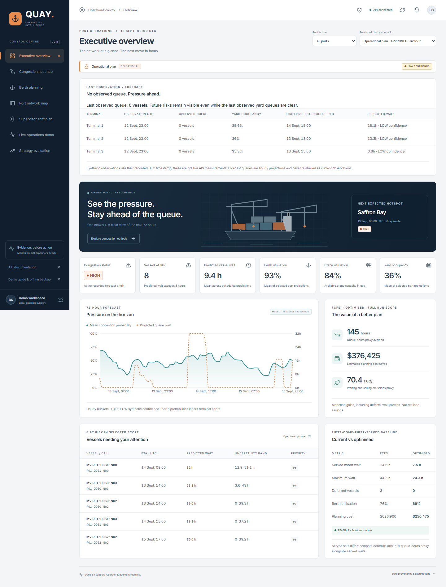

# QUAY - Container Congestion Predictor & Port Operations Optimiser

Predict congestion before the queue forms. Turn vessel schedules, weather, yard
stock and crane availability into an executable 72-hour supervisor plan.
**ML predicts, OR-Tools schedules, operators approve.** Explanations use trusted
results; an LLM cannot invent operational figures or dispatch vessels.

**BOB Operations Copilot:** optional IBM watsonx.ai / Granite chat integration
explains persisted results with validated evidence. Local fallback stays available;
the dashboard identifies the provider used for each response.
[IBM setup and verification](docs/watsonx-integration.md) .

## Start the five-minute demo

Requires Python 3.12, Node 22.13+ and npm. Run from this directory:

```powershell
npm run demo
```

The launcher installs locked dependencies on first use, verifies the bundled
synthetic seed/model, migrates a dedicated SQLite database and starts both services
on loopback. Open the **exact URL printed by the launcher** to start with the
approved Normal Operations plan. Allow dependency installation before your pitch.
Backend: port 8000; dashboard: port 5173. API documentation: `/docs` on the backend.
No Docker, PostgreSQL, AIS connection or LLM key is needed for this demo.

**Demo credentials:** click **Operator access**, paste
`quay-local-demo-only-operator-key-2026`, then **Unlock operations**.
Supervisor attribution defaults to `Demo supervisor`. This public key is restricted
to the isolated, loopback-only demo; production requires a private environment secret.

Stop both services with Ctrl+C. Restore the seeded demo, retaining an archive:

```powershell
npm run demo:reset
npm run demo
```

Reset refuses active services and only touches `artifacts/hackathon-demo/`.
Existing project databases, simulator outputs, models and approvals are preserved.
Reload the printed URL after reset to clear any old private-session URL.
Set `DEMO_API_PORT` / `DEMO_UI_PORT` if the default ports are occupied.

## Present

- [Exact five-minute script, 30-second pitch and judge answers](docs/hackathon-demo.md)
- [Offline backup: open this file without services](demo/backup/index.html)
- [Measured evaluation with assumptions and limitations](docs/hackathon-evaluation.md)
- [Implementation status and verification](docs/implementation-status.md)
- [Clean-install demo verification results](docs/hackathon-demo-verification.md)
- [Developer commands and detailed documentation](docs/developer-guide.md)

The presentation navigation contains overview, heatmap, berth timeline, map,
nine-shift plans, live events, BOB Operations Copilot and evaluation.
The development dashboard also contains the scenario lab.

## Completed versus future

| Completed local functionality | Future integrations / validation |
| --- | --- |
| Seeded 4-port simulator, 60 historical days and 7-day published schedule | Licensed AIS, identity matching and reliable ETA feeds |
| Versioned, chronological ML evaluation and hourly 72-hour forecasts | Real-port calibration; stronger surge forecasts and uncertainty coverage |
| Constrained CP-SAT, independently validated FCFS/fallback and rolling replanning | Port-specific labour/safety rules and operational shadow validation |
| Berth/crane/yard plans, nine shifts, JSON/CSV/printable HTML exports | TOS, crane PLC, yard inventory and customer contracts |
| Responsible conditional routing/arrival what-ifs and grounded explanations | Joint alternate-port reservations and customer-authorised dispatch |
| Persisted live events, SSE updates, frozen operations and audited approvals | Durable multi-instance workers, broker and production authentication gateway |

React/TypeScript + Recharts/Leaflet -> FastAPI services -> scikit-learn + OR-Tools
-> SQLAlchemy/Alembic. PostgreSQL is supported for production; the demo uses SQLite.
Docker recipes exist; Docker runtime was unavailable in this environment.

## Understand a forecast

Congestion heatmap → choose **Rows: Terminals** → select an hourly square →
scroll below the matrix. **Predicted outcomes** come from the FIFO resource
projection and vessel waiting models; **Model signal** shows congestion probability.
Known observations/schedules and future assumptions feed those outputs; stored
threshold evidence determines operational severity; operators review uncertainty
and approve plan changes. Probability is distinct from forecast confidence.

[Explanation screenshot](docs/screenshots/demo/forecast-explanation.png) ·
[Verification and provenance limits](docs/forecast-explanation-verification.md)

## Honest impact

Across the frozen synthetic evaluation, joint berth/crane served average wait
fell from **10.18->7.51h** (normal), **12.81->10.81h** (surge) and
**12.42->11.76h** (storm). Deferred demand and the 120-hour scheduling cutoff are
reported separately. Maximum wait increased; forecasts remain LOW confidence,
with surge waiting MAE **42.03h**. Predictive/routing advice added no measured
primary scheduling benefit over joint scheduling. Routing advice is unapproved.
All cost/emissions savings are **simulated proxies, not real-world validated savings**.



No commits or pushes without explicit permission.
